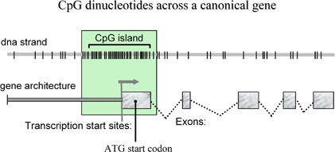

Скрытые Марковские модели

# Введение

HMM (Hidden Markov Models, Скрытые Марковские модели) -- это мощные инструменты, позволяющие моделировать биологические последовательности и выявлять скрытые стохастические процессы, которые управляют их формированием.

{fig-alt="https://www.google.com/url?sa=i&url=https%3A%2F%2Fm.youtube.com%2Fwatch%3Fv%3DRWkHJnFj5rY&psig=AOvVaw18rQYPNv-xvGZq_2Gi1Trd&ust=1731420593170000&source=images&cd=vfe&opi=89978449&ved=0CBcQjhxqFwoTCNDK3ry61IkDFQAAAAAdAAAAABAT" fig-align="center"}

В биоинформатике HMM используются для анализа последовательностей, предсказания генов и обнаружения мотивов. Они особенно полезны в задачах, связанных с последовательными данными, где скрытые состояния (такие как кодирующие и некодирующие регионы) оказывают влияние на наблюдаемые события (например, нуклеотидные последовательности). Например, HMM широко применяются для предсказания генов, где помогают определить кодирующие участки ДНК и, таким образом, раскрывают структуру и функции генов. Они также используются в множественном выравнивании последовательностей, что помогает сопоставлять родственные последовательности и изучать эволюционные взаимосвязи. Еще одной важной областью применения является обнаружение CpG-островков -- областей с высоким содержанием цитозина и гуанина, которые часто находятся в промоторных регионах генов. Кроме того, HMM являются основой для профильных HMM, которые применяются в классификации белковых семейств, как это реализовано в инструментах вроде HMMER. Эти модели помогают биоинформатикам назначать функции белкам, сопоставляя их с базой данных известных белковых семейств. В целом, HMM становятся незаменимыми для решения множества биологических задач, обеспечивая вероятностный подход, который упрощает понимание сложных биологических данных.

{fig-align="center"}

Скрытые марковские модели находят применение в решении ряда значимых биоинформатических задач. Например, с их помощью можно выполнять поиск генов в геноме: HMM позволяют определить, какие участки ДНК являются кодирующими, выделяя гены из длинных последовательностей нуклеотидов и предоставляя ученым ценную информацию о структуре и функциях этих генов. Еще один пример -- выявление CpG-островков: HMM позволяют находить области ДНК, обогащенные цитозином и гуанином, которые часто совпадают с промоторными регионами генов и могут указывать на активные участки генома. Это помогает исследователям понять механизмы регуляции генов и потенциальные точки взаимодействия с различными белками. Кроме того, HMM активно применяются в множественном выравнивании последовательностей, где они помогают выявить эволюционные связи между родственными белками или ДНК-цепочками, что особенно важно для изучения молекулярной эволюции и классификации биологических функций. Наконец, профильные HMM используются для идентификации белковых семейств в базе данных, что позволяет классифицировать белки на основе их сходства с уже известными семействами и предсказать их возможные функции, что особенно востребовано при исследовании новых или недостаточно изученных белков.

# Практическое задание

Данное практическое занятие будет посвящено применению HMM для поиска CpG-островков в геноме.

## Предисловие

### Что такое CpG-островки?

CpG-островки --- это специфические участки ДНК с высокой частотой сочетаний цитозина и гуанина (обозначаемых как CpG), которые играют важную роль в регуляции генов. Эти островки часто располагаются рядом с промоторами --- участками, ответственными за запуск транскрипции генов, --- особенно в геномах эукариот.

{fig-align="center"}

Одной из ключевых особенностей CpG-островков в промоторных областях является то, что они обычно остаются неметилированными, что способствует активной экспрессии гена. Напротив, их метилирование может приводить к «выключению» гена, подавляя его активность. Поэтому состояние CpG-островков --- метилированное или неметилированное --- становится своего рода переключателем, который помогает регулировать, будет ли ген экспрессироваться или нет.

{style="background-color: white" fig-align="center"}

### Как подготовить HMM?

Марковская модель описывает систему, которая переходит из одного состояния в другое, причем каждый переход зависит исключительно от текущего состояния (т.н. марковское свойство). Это означает, что будущее состояние системы определяется только ее текущим состоянием, а не всей предшествующей последовательностью событий.

Ключевые параметры для настройки моделиЖ

-   Состояния: Определите различные состояния, которые система может занимать. Например, в биоинформатике такие состояния могут представлять биологические признаки, как CpG-островки и некодирующие области генома.

-   Вероятности переходов: Укажите вероятности перехода из одного состояния в другое. Эти вероятности должны суммироваться до 1 для любого состояния, отражая все возможные пути, которые система может выбрать.

-   Начальные вероятности состояний: Задайте вероятности для того, чтобы система начала с определенного состояния. Эти вероятности используются для инициализации модели в начале последовательности.

### Как подготовить HMM. Частный случай.

Состояния: В этой HMM предусмотрены два состояния --- «CpG-островок» и «не-CpG-островок». Состояние CpG-островка представляет области генома с высокой частотой цитозин-гуаниновых динуклеотидов (CG), тогда как состояние не-CpG-островка охватывает стандартные участки генома с низким содержанием CG.

Вероятности перехода: Вероятности перехода между состояниями определяют, какова вероятность перемещения из одного состояния в другое. Например, вероятность остаться в состоянии CpG-островка может быть высокой, что отражает их цельный, локализованный характер. В то же время вероятность перехода из состояния «не-CpG-островок» в «CpG-островок» может быть ниже, так как CpG-островки обычно сконцентрированы в определенных участках генома, часто около промоторных регионов генов.

Вероятности эмиссии: Вероятности эмиссии описывают вероятность наблюдения конкретных нуклеотидов (A, C, G, T) в каждом состоянии. Для CpG-островков характерна более высокая вероятность появления нуклеотидов C и G, что отражает их уникальный состав, тогда как в не-CpG-областях эти вероятности распределены более равномерно.

Моделирование CpG-островков: Параметры HMM --- состояния, вероятности переходов и вероятности эмиссии --- создают модель, способную распознать CpG-островки на основе их биологических особенностей, таких как высокое содержание CG и их расположение вблизи промоторных областей. Таким образом, модель не только различает CpG и не-CpG участки, но и выделяет те, что с наибольшей вероятностью играют роль в регуляции генов.

Графическое представление: Визуальная схема HMM наглядно отображает модель. В ней состояния представлены узлами, а переходы между ними --- стрелками с указанием вероятностей. Такой граф помогает представить, как система переходит между состояниями и в какой последовательности.

Пример работы модели: Рассмотрим гипотетическую последовательность ДНК, чтобы пошагово продемонстрировать работу HMM в определении CpG- и не-CpG-областей. Модель поочередно анализирует каждый нуклеотид и на основе вероятностей эмиссии и переходов «шагает» по состояниям, определяя, где последовательность вероятнее всего является CpG-островком. Такой пошаговый анализ позволяет увидеть, как HMM оценивает данные, выделяя структурные особенности генома.

## Алгоритм Витерби

Алгоритм Витерби --- это метод динамического программирования, который позволяет определить наиболее вероятную последовательность скрытых состояний в скрытой марковской модели (HMM) для данной последовательности наблюдаемых событий. Алгоритм вычисляет путь, который максимизирует вероятность наблюдаемой последовательности, путем итеративного расчета наивысшей вероятности для каждого состояния на каждом этапе. При этом сохраняется информация как о вероятностях, так и о «указателях» (backpointer), необходимых для восстановления оптимального пути по завершении расчетов. Благодаря рекурсивному подходу алгоритм эффективно отслеживает путь, ведущий к каждому состоянию, избегая необходимости полного перебора всех возможных путей.

Почему выбран алгоритм Витерби для данной задачи Алгоритм Витерби особенно подходит для выявления CpG-островков в последовательностях ДНК, так как он позволяет точно расшифровать последовательность в разные состояния (например, «CpG-островок» и «не-CpG-островок») на основе HMM. Высокая вычислительная эффективность делает его идеальным инструментом для анализа длинных последовательностей ДНК, типичных для биоинформатических исследований. Определяя наиболее вероятную последовательность скрытых состояний, алгоритм помогает выявлять биологически значимые области с высоким содержанием CG, что связано с функциями регуляции генов.

Другие применения алгоритма Витерби Помимо обнаружения CpG-островков, алгоритм Витерби находит широкое применение в различных областях биоинформатики и вычислительной биологии. Например, он используется для предсказания генов, помогая определить расположение экзонов и интронов в геномной последовательности. Алгоритм также применяется в множественном выравнивании последовательностей, где он помогает выровнять родственные биологические последовательности и выявить консервативные регионы. За пределами биоинформатики алгоритм Витерби также используется в системах распознавания речи, языковом моделировании и робототехнике для определения наиболее вероятной последовательности состояний в различных марковских системах.

## Имплементация алгоритма

Инициализация матрицы Витерби При работе с алгоритмом Витерби первым шагом является инициализация матрицы, в которой будут храниться вероятности наиболее вероятных путей для каждого состояния на каждом шаге последовательности. Эта матрица позволяет моделировать вероятностный путь через последовательность ДНК, учитывая наиболее вероятные переходы между состояниями.

Итерация по последовательности В процессе итерации по последовательности ДНК, шаг за шагом, вычисляется вероятность нахождения в каждом из возможных состояний (например, «CpG-островок» или «не-CpG-островок») на каждом этапе последовательности. Этот шаг позволяет постепенно накапливать вероятности, связанные с каждым состоянием в последовательности.

Построение и использование матрицы Витерби Создание матрицы Витерби (V): Эта матрица (V) используется для хранения максимальной вероятности достижения каждого состояния в каждый момент последовательности. Дополнительно создается матрица указателей (backpointer), которая сохраняет наиболее вероятное предыдущее состояние для каждого текущего состояния, что будет полезно на этапе определения пути.

Выбор конечного состояния: В последней колонке матрицы V определяется состояние с наивысшей вероятностью, которое считается конечной точкой на наиболее вероятном пути.

Обратный проход (backtracking): Начиная с выбранного конечного состояния, матрица указателей используется для «обратного прохода» через последовательность, чтобы восстановить наиболее вероятный путь скрытых состояний. Этот процесс позволяет точно определить участки, такие как CpG-островки, в анализируемой последовательности.

``` python
import numpy as np

# Example HMM parameters
states = ['CpG', 'non-CpG']
observations = ['A', 'C', 'G', 'T']
state_to_idx = {'CpG': 0, 'non-CpG': 1}
obs_to_idx = {'A': 0, 'C': 1, 'G': 2, 'T': 3}

# Transition probabilities
trans_probs = np.array([[0.999, 0.001],  # From CpG
                        [0.005, 0.995]])  # From non-CpG

# Emission probabilities
emis_probs = np.array([[0.1, 0.4, 0.4, 0.1],  # CpG
                       [0.25, 0.25, 0.25, 0.25]])  # non-CpG

# Observed sequence (e.g., 'ACGT')
observed_sequence = 'ACGT'
obs_idx_sequence = [obs_to_idx[nuc] for nuc in observed_sequence]

# Number of states and sequence length
n_states = len(states)
seq_len = len(observed_sequence)

# Viterbi matrix to store max probabilities
V = np.zeros((n_states, seq_len))

# Backpointer matrix to store the best path
backpointer = np.zeros((n_states, seq_len), dtype=int)

# Initialization
for s in range(n_states):
    V[s, 0] = emis_probs[s, obs_idx_sequence[0]]
    backpointer[s, 0] = 0

# Iteration
for t in range(1, seq_len):
    for s in range(n_states):
        transition_probs = [V[prev_state, t - 1] * trans_probs[prev_state, s] for prev_state in range(n_states)]
        max_transition_prob = max(transition_probs)
        V[s, t] = max_transition_prob * emis_probs[s, obs_idx_sequence[t]]
        backpointer[s, t] = np.argmax(transition_probs)

# Termination: Finding the best last state
last_state = np.argmax(V[:, -1])
best_path = [last_state]

# Tracking back to find the best path
for t in range(seq_len - 1, 0, -1):
    last_state = backpointer[last_state, t]
    best_path.append(last_state)

# Reverse the path to get the correct order
best_path = best_path[::-1]

# Convert state indices back to state names
best_path_states = [states[state] for state in best_path]

# Output the result
print("Most probable sequence of states:")
print(best_path_states)
```

# Домашнее задание

## Цель

Научиться применять скрытую марковскую модель (HMM) для обнаружения CpG-островков в последовательности ДНК, закрепив теоретические знания, полученные на занятиях.

## Задачи

1.  **Определение модели**: Задайте HMM с двумя состояниями («CpG» и «не-CpG»), указав разумные начальные значения для вероятностей переходов и эмиссий.

2.  **Реализация алгоритма**: Реализуйте алгоритм Витерби на Python для поиска CpG-островков в длинной последовательности ДНК. Этот этап опирается на материал, изученный на занятии, где вы узнали, как применять алгоритм Витерби для нахождения наиболее вероятной последовательности состояний. Теперь ваша задача --- применить эти знания к большему и более сложному набору данных.

3.  **Обучение алгоритмом Баум-Велша**: Реализуйте алгоритм Баум-Велша для уточнения параметров модели. Этот алгоритм выбран для закрепления навыков, так как он дополняет алгоритм Витерби. В то время как Витерби используется для нахождения наиболее вероятного пути состояний, Баум-Велш позволяет обучать параметры HMM, опираясь исключительно на наблюдаемые данные, когда точные пути состояний неизвестны. Таким образом, студенты получат целостное представление о HMM, переходя от декодирования к оценке параметров. Итогом работы станет способность корректировать вероятности переходов и эмиссий на основе реальных данных, улучшая точность модели.

4.  **Визуализация**: Постройте графическое изображение предсказанных CpG-островков (например, с использованием matplotlib). Визуализация позволяет интерпретировать работу модели, наглядно показывая, какие участки последовательности распознаются как CpG-островки.

5.  **Анализ чувствительности параметров**: Экспериментируйте с различными начальными значениями для вероятностей переходов и эмиссий и анализируйте, как это влияет на точность предсказаний и сходимость модели. Этот анализ поможет понять, насколько модель чувствительна к начальному выбору параметров, закрепив знания о её устойчивости и стабильности.

6.  **Сравнение с реальными данными**: Возьмите последовательность ДНК из публичной базы данных (например, NCBI) с известными CpG-островками и проверьте, насколько модель совпадает с существующими аннотациями. Сравнение результатов с реальными данными поможет оценить практическую полезность и точность модели.

7.  **Оценка точности**: Рассчитайте чувствительность, специфичность и F1-метрику для оценки работы модели, обсудив возможные причины расхождений. Эти метрики помогут количественно оценить точность модели и выявить направления для улучшения.

Материалы для сдачи:

1.  **Python-код**: Отправьте документированные скрипты на Python.

2.  **Отчет** (3--5 страниц): Подготовьте подробный отчет, включающий описание подхода, трудностей, анализа чувствительности и результатов, а также графики и диаграммы.
